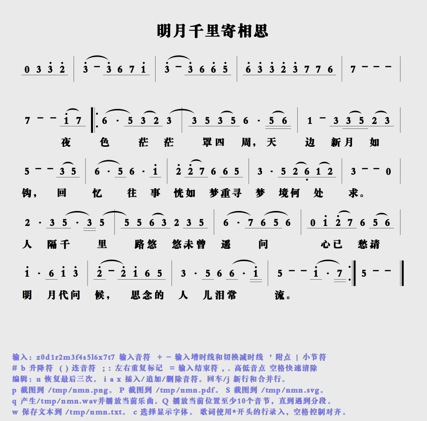
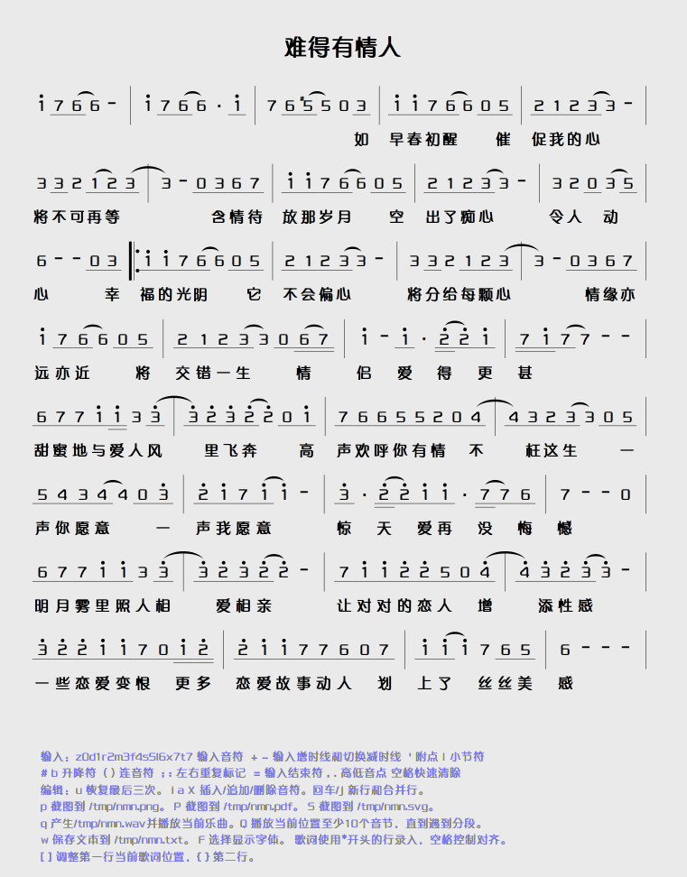

# nmn

## 可视化简谱编写软件

- 编辑排版，生成wav,png,pdf,svg,txt。
- 播放`wav`需要安装`siggen`包。
- 界面下面直接看帮助。

> 2013-09的一个老软件，翻出来。以前只能建两个免费仓库。。

## 编译参数

`valac --pkg gtk+-3.0 nmn.valac`

> 以前的源码，有一些内部`deprecated`，导致有几个警告。

